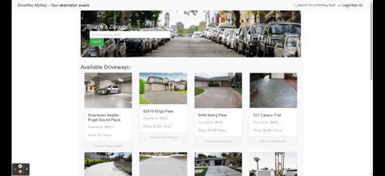

# DriveWay_MyWay

## Description
The DriveWay-MyWay site presents you with current listings of driveways available for your parking needs and a navigation bar to allow you to login or sign up. You can search driveways by zipcode, and view a driveway’s details with a map of its location. When you are ready to reserve a spot, you can make reservations and payments online, and these orders will appear in your order history. You can also post your own driveway with all the relevant details and upload images. When the driveway is reserved, it will be taken out of the listings, or you can edit or delete them yourself.

The following GIFs show the application in use:  
   
  

## User Story
AS a car driver  
WHEN I arrive at a destination and parking is unavailable  
I want to search private driveways near my current location that are available for cheap and secure paid parking. 

## MVP Features
- Site navigation  
- Zipcode search bar  
- Driveway listing views  
- User Login/Signup  
- User driveway post & upload (Cloudinary)  
- Listing details & mapping (Google Maps API)  
- Listing reservation & payment (Stripe)

## Tech Stack
- React  
- GraphQL  
- MongoDB/Atlas  
- Express/Node  
- Heroku  
- Google-map-react  
- Cloudinary  
- Stripe  
- Git

## Link
https://driveway-myway.herokuapp.com/
